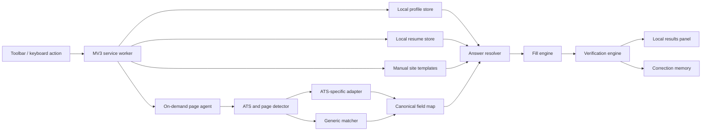

# Local Job Application Autofill Extension — Consolidation Notice

The two original design drafts have been consolidated. The authoritative product,
architecture, safety, performance, test, and delivery specification is now:

- [`docs/LOCAL_JOB_AUTOFILL_DESIGN.md`](docs/LOCAL_JOB_AUTOFILL_DESIGN.md)

That document incorporates this draft's user-triggered `activeTab` architecture,
manual site-template precedence, and **Teach This Page** workflow alongside the
more detailed schemas, confidence policy, side-panel flow, verification engine,
test strategy, and delivery gates from the other draft.

The remainder of this file is retained as historical design context. If the two
documents conflict, the authoritative document wins.

---

# Historical draft

Status: Proposed  
Target platform: Google Chrome on one local laptop  
Distribution: Unpacked local extension  
Primary priorities: 1) correctness, 2) speed, 3) maintainability

## 1. Objective

Build a clean-room Chrome extension that fills job application forms from a locally stored profile. It should perform the common autofill workflow substantially faster than a general-purpose job-search extension while minimizing incorrect or destructive fills.

The product is intentionally narrow: it is a personal, local tool rather than a hosted service. There is no account system, remote backend, telemetry, subscription logic, job board, or cross-device synchronization.

## 2. Success criteria

### Accuracy

Accuracy is measured as precision and coverage, not as one combined percentage:

- **Precision:** Of the fields the extension fills automatically, at least 99% should receive the intended value on explicitly supported ATS platforms.
- **Coverage:** Fill at least 95% of recognized, answerable fields on supported application forms.
- **High-impact errors:** Never silently fill the wrong resume, work-authorization answer, sponsorship answer, demographic answer, or legal attestation.
- **Verification:** Every write is read back from the live control and checked before being marked successful.
- **Conservative fallback:** An unknown or ambiguous field is left untouched rather than filled with a low-confidence guess.

These are engineering targets. A growing regression corpus will determine whether they are being met.

### Speed

Performance targets are measured on the development laptop against a representative 30–50-field application form:

- Zero page-side JavaScript or DOM observers when the extension has not been invoked.
- Toolbar click to scan start: no more than 100 ms at p95.
- Fill a normal supported page: no more than 250 ms at p50 and 750 ms at p95, excluding file transfer and site/network delays.
- Keep individual main-thread work slices below 16 ms where practical.
- Initial injected runtime target: under 100 KB compressed, with ATS adapters loaded only when needed.
- No network request on the critical autofill path.

### Safety and control

- Never submit an application.
- Never advance to the next page without an explicit user action.
- Never overwrite a non-empty field unless the user enables replacement or chooses a specific correction.
- Keep all profile data, resumes, answer history, and diagnostics on the laptop.

## 3. Scope

### Version 1

- Local profile editor and JSON import/export.
- Multiple named resumes with one explicitly selected for each fill operation.
- Reusable answers for common application questions.
- Deterministic support for:
  - Greenhouse
  - Lever
  - Ashby
  - Workday
- Generic fallback for conventional HTML forms.
- Text, email, telephone, URL, number, textarea, checkbox, radio, native select, common custom combobox, and date controls.
- Repeatable employment and education sections.
- Multi-page applications, with an explicit Fill Page action on each page.
- Post-fill verification, a concise result summary, and highlighted skipped/ambiguous fields.
- A local correction memory for recurring questions and site-specific mappings.
- A manual site-template editor for Ashby, Workday, Greenhouse, Lever, individual employers, and individual applications.
- A **Teach This Page** mode that lets the user choose exactly what value or profile field belongs in each detected control.

### Deferred

- AI-generated answers, resume tailoring, or cover-letter generation.
- Job discovery, job tracking, or analytics dashboards.
- Cloud backup or synchronization.
- Automatic application submission.
- Automatic answers to sensitive demographic or legal questions without explicit saved values and opt-in.
- CAPTCHA solving.
- Firefox, Safari, or mobile support.

The first version favors deterministic rules and saved answers. A local language model can be evaluated later for long-form questions, but it must not sit on the normal autofill critical path.

## 4. User workflow

1. Load the unpacked extension in Chrome.
2. Open the extension settings and create a local profile.
3. Add one or more resumes and reusable application answers.
4. Optionally create ATS-wide or employer-specific templates for answers that should always be handled explicitly.
5. Navigate to a job application page.
6. Click the extension button or use a keyboard shortcut.
7. Review the detected application identity, applicable site template, and selected resume.
8. Choose **Fill Page**, or choose **Teach This Page** to map the visible fields manually.
9. The extension scans, maps, fills, dispatches site-compatible events, and verifies each field.
10. A small result panel reports filled, skipped, ambiguous, and failed fields.
11. The user reviews the form and submits it manually.

No code runs in the page before step 5 in the initial design.

## 5. Architecture



### 5.1 Manifest V3 shell

The extension uses Manifest V3 with an event-driven service worker. The initial permission set should be:

- `activeTab`: temporary access after a user gesture.
- `scripting`: on-demand injection of the page agent.
- `storage`: local preferences and small structured records.

The initial release should avoid static content scripts and `*://*/*` host permissions. If automatic activation is later valuable, it can use narrowly allowlisted ATS origins through dynamic content-script registration.

All executable code is packaged with the extension. There is no remotely hosted JavaScript.

### 5.2 Service worker/coordinator

Responsibilities:

- Handle the toolbar action and keyboard shortcut.
- Inject the smallest possible page detector into the active tab.
- Load the matching ATS adapter only after platform detection.
- Retrieve the active local profile, answer bank, and selected resume metadata.
- Resolve applicable manual templates from ATS-wide, employer, and application scopes.
- Coordinate messages between the page agent and extension UI.
- Maintain per-tab, short-lived fill sessions.

The worker must not keep polling loops or persistent ports merely to stay alive. Every operation must tolerate worker suspension and reconstruct state from the local session record.

### 5.3 Profile manager

The profile manager is an extension page, not page-injected UI. It edits a canonical schema containing:

- Identity and contact information.
- Address.
- Professional URLs.
- Work authorization and sponsorship preferences.
- Employment history.
- Education history.
- Skills and certifications.
- Voluntary demographic answers, disabled by default.
- Reusable short and long answers.
- Resume metadata and the default resume selection.
- Manually configured ATS, employer, and application templates.

All values retain provenance: `explicit`, `imported`, or `learned`. Only explicit values may be used for high-impact fields.

### 5.4 Local data layer

Use two storage mechanisms:

- `chrome.storage.local` for settings, profile JSON, answer metadata, correction rules, and schema version.
- Extension-scoped IndexedDB for resume files, larger answer content, sanitized fixtures, and optional local diagnostics.

Do not use `chrome.storage.sync`. Data migrations are explicit, versioned, and tested. Writes use copy-on-write semantics so an interrupted update does not corrupt the active profile.

Suggested top-level records:

```ts
interface LocalState {
  schemaVersion: number;
  activeProfileId: string;
  profiles: Record<string, Profile>;
  answerRules: AnswerRule[];
  siteTemplates: SiteTemplate[];
  correctionRules: CorrectionRule[];
  preferences: Preferences;
}
```

Export produces a human-readable JSON profile plus separately selected resume files. Import validates every property before replacing local state.

### 5.5 Page and ATS detector

Detection uses cheap signals in this order:

1. Hostname and URL structure.
2. Stable application-root selectors.
3. Known script, form, or DOM markers.
4. Generic-form fallback.

Detection returns an adapter ID and confidence. A low-confidence ATS identification falls back to the generic matcher rather than running platform-specific mutations against the wrong page.

### 5.6 ATS adapters

Each ATS adapter is a small module that implements a common interface:

```ts
interface AtsAdapter {
  detect(document: Document, location: Location): DetectionResult;
  findApplicationRoot(): Element;
  enumerateFields(root: Element): FieldDescriptor[];
  revealRepeatableSection?(section: SectionKind, count: number): Promise<void>;
  writeField(field: FieldDescriptor, value: ResolvedValue): Promise<WriteResult>;
  verifyField(field: FieldDescriptor, value: ResolvedValue): VerificationResult;
}
```

Adapters handle platform behavior that a generic matcher cannot reliably infer:

- Custom select and combobox components.
- React/Vue/Angular controlled inputs.
- Workday-style multi-page and repeatable sections.
- Platform-specific resume upload behavior.
- Required event sequences.
- Hidden duplicate inputs and accessibility proxy controls.

Adapters take priority over generic heuristics. Shared primitives prevent four divergent implementations of ordinary controls.

### 5.7 Field discovery

The scanner produces a normalized `FieldDescriptor` for every visible, enabled, user-editable control. It collects multiple signals:

- Associated `<label>` text.
- `aria-label`, `aria-labelledby`, and accessible description.
- `name`, `id`, `autocomplete`, type, role, placeholder, and input mode.
- Fieldset legend and nearby section heading.
- Surrounding question text and help text.
- Option values and displayed option labels.
- Required state, validation constraints, and current value.
- Repeat-group and row context.

The scanner ignores hidden honeypots, search/navigation controls, disabled inputs, duplicate accessibility proxies, and controls outside the detected application root.

The initial scan is one bounded pass. Dynamic rescans are scoped to the application root and triggered only during an active fill session. Mutation records are batched and debounced.

### 5.8 Canonical field taxonomy

All adapters map site controls into stable semantic keys, for example:

```text
person.first_name
person.last_name
contact.email
contact.phone
address.city
links.linkedin
work_authorization.country
work_authorization.requires_sponsorship
employment[0].company
employment[0].start_date
education[0].degree
application.salary_expectation
application.available_start_date
demographic.gender
custom.<question_fingerprint>
```

The taxonomy separates similar-looking but semantically different values, such as current location versus desired work location and authorization country versus citizenship.

### 5.9 Matching and confidence engine

Matching is deterministic and explainable. It combines:

- Exact ATS adapter mapping.
- HTML `autocomplete` mapping.
- Exact normalized label aliases.
- Section-aware label matching.
- Control-type compatibility.
- Option-set compatibility.
- Previously confirmed site correction.
- Conservative fuzzy text similarity for low-risk fields.
- Negative evidence, such as `emergency contact`, `reference`, or `recruiter` near a generic `name` field.

Every candidate produces a score and reasons. Suggested thresholds:

- **At least 0.92:** fill automatically.
- **0.72–0.91:** show as a suggestion; require confirmation.
- **Below 0.72:** leave untouched.

High-impact fields require an adapter mapping, an exact semantic match, or a prior explicit correction regardless of numerical score. Fuzzy matching alone can never fill them.

When two profile values compete for one field, or two controls compete for one value, the engine records ambiguity rather than choosing arbitrarily.

### 5.10 Answer resolver

The resolver converts a semantic field into a concrete value. Resolution order:

1. Explicit site-specific correction rule.
2. ATS-specific deterministic rule.
3. Exact canonical profile field.
4. Exact reusable-question fingerprint.
5. Normalized question template match.
6. Conservative generic semantic match.
7. No answer.

Question fingerprints normalize casing, punctuation, whitespace, required markers, and employer-specific prefixes without erasing meaningful distinctions. Answers may include applicability constraints such as country, role family, employment type, or employer.

The answer bank stores both the canonical answer and the exact question under which the user confirmed it. Learned answers are never generalized to sensitive questions automatically.

### 5.11 Manual site templates and Teach mode

Manual configuration is a primary accuracy feature, not merely an error-recovery mechanism. A site template can tell the extension exactly what to do with a known field on a popular ATS.

A template rule can choose one of four actions:

- **Use profile field:** map the control to a canonical value such as `contact.phone` or `employment[0].company`.
- **Use fixed value:** enter an explicit string, boolean, date, or option for this scope.
- **Use saved answer:** reference a reusable answer by ID.
- **Always skip:** deliberately leave the field for manual completion.

Templates support progressively narrower scopes:

1. ATS-wide, such as all Ashby or all Workday applications.
2. Employer/tenant, such as one company's Ashby board or Workday tenant.
3. Form/question fingerprint, for a recurring employer-specific question.
4. Exact application, for a one-off override tied to an application URL or job ID.

Narrower explicit rules override broader rules. An exact application rule overrides an employer rule, which overrides an ATS-wide rule. All explicit template rules override learned corrections and automatic matching.

```text
exact application template
    > employer/tenant template
    > ATS-wide template
    > confirmed correction memory
    > automatic ATS mapping
    > generic matching
```

The template editor is available in two places:

- **Settings:** Create and edit templates without visiting a form. This is best for common questions and global ATS defaults.
- **Teach This Page:** Scan the active form, show each field's label, type, options, and proposed mapping, and let the user select a profile field, fixed value, saved answer, or skip action.

Teach mode is read-only until the user presses **Save Template** or **Save and Fill**. It must never infer that a value manually typed directly into the application should be remembered without an explicit confirmation.

Each manual rule stores:

```ts
interface SiteTemplateRule {
  id: string;
  scope: TemplateScope;
  ats: AtsId;
  tenant?: string;
  applicationId?: string;
  fieldFingerprint: FieldFingerprint;
  questionFingerprint?: string;
  action:
    | { kind: "profile"; path: CanonicalFieldPath }
    | { kind: "fixed"; value: TypedValue }
    | { kind: "answer"; answerId: string }
    | { kind: "skip" };
  expectedControlType: ControlType;
  expectedOptionsHash?: string;
  createdAt: number;
  confirmedAt: number;
}
```

For controls with options, the editor records the intended displayed option and normalized semantic value rather than a brittle numeric index. If the option set changes, the rule is marked stale and requires confirmation instead of selecting the closest option.

Templates can also specify a default resume, but an application-level preview must display that choice before filling. Sensitive answers require a visibly explicit rule; they cannot be inherited from a fuzzy question match.

All templates remain local, are included in explicit JSON export/import, can be disabled individually, and show when they last matched a live form.

### 5.12 Fill engine

The fill engine groups writes by dependency rather than blindly iterating over DOM order:

1. Reveal required repeatable sections.
2. Fill simple text-like controls.
3. Fill native selects, radios, and checkboxes.
4. Fill framework-controlled and custom components.
5. Attach the explicitly selected resume.
6. Wait for bounded dynamic updates.
7. Rescan newly revealed dependent fields.
8. Verify all writes.

The engine uses the native property setter appropriate to each control and dispatches the smallest correct input/change/blur event sequence. ATS adapters override this sequence where necessary.

Writes are idempotent. Re-running Fill Page should not create duplicate experience rows or toggle already correct checkboxes.

Non-empty fields are preserved by default. A user can choose **Correct mismatches** after the verification report identifies them.

### 5.13 Resume handling

Resumes are stored as local blobs with metadata:

- Internal ID.
- Display name.
- Original filename.
- MIME type and byte size.
- SHA-256 digest.
- Optional applicability tags.
- Last selected timestamp.

The user selects a resume for the current fill session before any file input is changed. The upload is verified by reading the resulting file name and, when exposed, the site upload status. If a site prevents a reliable programmatic attachment, the extension opens the file picker workflow and reports the upload as requiring manual completion.

Resume selection is never inferred solely from the job title in version 1.

### 5.14 Verification engine

Verification is part of filling, not an optional later audit. For every attempted field it checks:

- The live control value equals the normalized intended value.
- The selected option/radio/checkbox state is correct.
- The control does not report a native validation error caused by the write.
- A custom component's displayed label and backing value agree.
- The field remains correct after the site's immediate reactive update.
- For uploads, the displayed file identity matches the selected resume.

Results use four states:

- `verified`
- `skipped`
- `ambiguous`
- `failed`

The UI must not report a field as filled merely because an assignment call returned without throwing.

### 5.15 Correction memory

When the user corrects a skipped or incorrect mapping, the extension can save a local rule containing:

- ATS and hostname scope.
- Stable selector or structural fingerprint.
- Normalized question fingerprint.
- Canonical semantic key or answer ID.
- Control and option-set fingerprint.
- User confirmation timestamp.

Rules prefer structural and accessibility attributes over brittle generated CSS class names. A rule is ignored when the field's structural fingerprint changes materially.

The user can inspect and delete all learned rules in settings.

### 5.16 Results UI

The in-page UI should be a small, dependency-free panel rendered in a closed visual container such as Shadow DOM. It is injected only for an active session and removed when dismissed.

It shows:

- Selected profile and resume.
- The matching ATS, employer, and application templates, with the winning scope.
- Counts for verified, skipped, ambiguous, and failed fields.
- A short list of items requiring attention.
- Fill Page, Teach This Page, Correct Mismatches, and Dismiss actions.

It should not render a full React application inside every application page. The profile editor can be a normal extension page because it is outside the performance-sensitive page context.

## 6. Accuracy strategy

The extension follows a precision-first hierarchy:

```text
explicit application template
    > explicit employer/tenant template
    > explicit ATS-wide template
    > confirmed local correction
    > ATS adapter mapping
    > exact semantic HTML/accessibility mapping
    > context-aware aliases
    > conservative fuzzy matching
    > skip
```

Important practices:

- Separate field detection from answer selection and from writing. Each can be tested independently.
- Make every explicit site-template rule inspectable and ensure it wins over automatic inference.
- Preserve the evidence and score behind every mapping for debugging.
- Normalize dates, phone numbers, URLs, and option text according to the target control rather than modifying source profile data.
- Treat yes/no questions as semantic questions, not as boolean controls with universal meaning.
- Match select options using normalized labels plus safe domain aliases; never select the first approximate option.
- Use section context to disambiguate repeated `name`, `title`, `city`, and `date` fields.
- Re-read the DOM after reactive rerenders because some frameworks replace the original element.

## 7. Performance strategy

- Use `activeTab` and `chrome.scripting.executeScript()` for user-triggered injection.
- Keep the detector separate from the fill engine and adapters.
- Dynamically import exactly one ATS adapter.
- Use plain TypeScript and browser APIs in the page runtime; avoid a large UI framework.
- Build indexed alias tables once per injected session.
- Traverse the application root once and retain normalized descriptors.
- Batch DOM reads before writes to reduce forced layout.
- Avoid computed style reads unless visibility cannot be determined structurally.
- Debounce scoped mutation processing and disconnect observers as soon as the session is complete.
- Avoid background polling, analytics, remote configuration, and network-dependent answer resolution.
- Keep debug tracing off by default and cap its local retention.

Bundle size is a useful constraint but not the primary metric. CPU time, long tasks, number of scanned nodes, mutation volume, and end-to-end verified fill latency must be measured directly.

## 8. Suggested implementation stack

- TypeScript with strict compiler settings.
- Manifest V3.
- esbuild for small, fast, separately emitted bundles.
- Plain DOM UI or a very small view helper; no full UI framework in the content runtime.
- IndexedDB and `chrome.storage.local` with hand-written runtime schema validation.
- Vitest or equivalent for pure matching/normalization tests.
- Playwright with Chromium and the unpacked extension for end-to-end fixtures.
- ESLint and Prettier for static consistency.

The production build must have no required runtime dependencies outside the packaged extension.

## 9. Proposed repository structure

```text
manifest.json
package.json
src/
  background/
    service-worker.ts
    session-manager.ts
  content/
    detector.ts
    page-agent.ts
    results-panel.ts
  adapters/
    adapter.ts
    greenhouse.ts
    lever.ts
    ashby.ts
    workday.ts
    generic.ts
  engine/
    discover.ts
    taxonomy.ts
    match.ts
    resolve.ts
    fill.ts
    verify.ts
    controls/
  profile/
    schema.ts
    normalize.ts
  storage/
    local-state.ts
    resume-store.ts
    migrations.ts
  ui/
    options.html
    options.ts
tests/
  unit/
  fixtures/
  e2e/
  performance/
```

## 10. Testing and measurement

### Unit tests

- Label and question normalization.
- Canonical-field mapping.
- Confidence scoring and negative evidence.
- Date, phone, URL, and option conversion.
- Answer applicability constraints.
- Storage migrations and import validation.
- Manual-template scope precedence, fixed values, skip rules, and stale-rule detection.

### Fixture tests

Maintain sanitized HTML fixtures representing each supported ATS and important control pattern. Each fixture has a golden mapping and expected verified output. Fixtures must include:

- Empty and partially completed forms.
- Duplicate and misleading labels.
- Hidden honeypot fields.
- Custom comboboxes.
- Dynamic dependent questions.
- Multiple employment and education entries.
- Rerendered framework controls.
- Resume uploads.
- ATS-wide, employer-specific, and exact-application manual templates.
- Changed labels or option sets that must invalidate stale manual rules.

### End-to-end tests

Run Chromium with the unpacked extension and exercise the real interaction path: toolbar action, scan, fill, and read-back verification. Do not rely only on calling internal matcher functions.

### Regression capture

When a real site fails, save a sanitized structural snapshot containing labels, attributes, option text, and component structure but no entered personal data. Turn the failure into a red test before changing an adapter.

### Performance tests

Record:

- Detector and adapter load time.
- DOM nodes visited.
- Field discovery time.
- Matching and resolution time.
- Write and verification time.
- Long tasks over 50 ms.
- Peak page-agent memory where measurable.
- Total bundle bytes per injected path.

Performance budgets fail CI when exceeded beyond a small allowed variance.

## 11. Failure handling

- If injection is blocked, report that the page is unsupported without changing it.
- If ATS detection is ambiguous, use the generic read-only scan and ask before filling.
- If the page rerenders during filling, reacquire controls by structural fingerprint and retry once.
- If verification fails, stop retrying after a small bounded count and highlight the field.
- If a stored correction no longer matches structurally, quarantine it rather than applying it.
- If a manual template's control type or option fingerprint changes, show it as stale and require confirmation.
- If local profile data fails schema validation, preserve the last valid snapshot and disable filling until repaired.

There are no unbounded retries, observers, timers, or waits.

## 12. Security and privacy

Although this is a personal local tool, it handles unusually sensitive data. Therefore:

- No telemetry, crash upload, remote configuration, or third-party requests.
- No `chrome.storage.sync`.
- Minimal permissions with user-triggered `activeTab` access.
- No remote code or `eval`-style execution.
- No reading password fields, cookies, browsing history, or unrelated page content.
- Diagnostics redact field values by default.
- Export requires an explicit user action and warns that the JSON contains personal data.
- Resume and profile deletion removes associated local records and correction rules where applicable.

Local-only does not mean encrypted-at-rest by the extension. The initial version relies on the laptop account and full-disk encryption. Optional passphrase encryption can be added later, but it should not complicate or slow the core fill path.

## 13. Delivery phases

### Phase 0 — Measurement harness

- Scaffold the MV3 extension and build system.
- Implement an unpacked-extension test launcher.
- Establish fixture, accuracy, and performance reporting.
- Define the canonical profile schema and representative test profile.

### Phase 1 — Fast deterministic core

- Profile editor and local storage.
- Manual site-template editor and Teach This Page workflow.
- Field discovery, taxonomy, matcher, fill primitives, and verification.
- Greenhouse and Lever adapters.
- Generic form fallback.
- Results panel.

### Phase 2 — Difficult application flows

- Ashby and Workday adapters.
- Repeatable employment/education sections.
- Custom combobox hardening.
- Resume storage and upload.
- Multi-page session continuity.

### Phase 3 — Accuracy hardening

- Correction memory and answer fingerprints.
- Template inspection, bulk enable/disable, and JSON import/export hardening.
- Larger regression corpus.
- Performance profiling and budget enforcement.
- Packaging and one-command local rebuild instructions.

## 14. Key design decisions

1. **Clean-room implementation:** Do not modify or depend on Simplify's packaged code or private APIs.
2. **User-triggered operation:** No always-on content script in the initial version.
3. **Precision over maximum fill count:** Ambiguous fields are skipped.
4. **Manual intent wins:** Explicit application, employer, and ATS templates override all inferred mappings.
5. **ATS adapters before generic cleverness:** Known platforms receive deterministic handling.
6. **Verification is mandatory:** A successful assignment is not enough.
7. **Local deterministic critical path:** No server or language-model dependency for normal fields.
8. **Explicit resume choice:** Never guess which document to upload.
9. **No auto-submit:** Final review remains with the user.

## 15. Main risks

| Risk | Effect | Mitigation |
| --- | --- | --- |
| ATS DOM changes | Adapter regressions | Structural selectors, fixture corpus, local corrections, fast adapter updates |
| Custom framework controls | Value appears filled but is not accepted | Native setters, correct event sequences, site adapters, read-back verification |
| Ambiguous natural-language questions | Incorrect answer | Confidence thresholds, context constraints, suggestion/skip behavior |
| Stale manual template | Explicit but outdated value is applied | Structural fingerprints, option hashes, stale-rule quarantine, preview of winning scope |
| Multi-page dynamic forms | Missed dependent fields | Per-page explicit fill sessions, scoped rescans, bounded reacquisition |
| Resume upload restrictions | Failed or wrong attachment | Explicit selection, digest metadata, upload verification, manual fallback |
| Overfitting to one form | Poor generalization | Separate ATS fixtures, negative cases, generic fallback kept conservative |
| Performance regression | Slower browsing or fill | On-demand injection, code splitting, CI budgets, no persistent observers |

## 16. References

- [Chrome: Content scripts](https://developer.chrome.com/docs/extensions/develop/concepts/content-scripts)
- [Chrome: `chrome.scripting`](https://developer.chrome.com/docs/extensions/reference/api/scripting)
- [Chrome: The `activeTab` permission](https://developer.chrome.com/docs/extensions/develop/concepts/activeTab)
- [Chrome: Manifest V3](https://developer.chrome.com/docs/extensions/develop/migrate/what-is-mv3)
